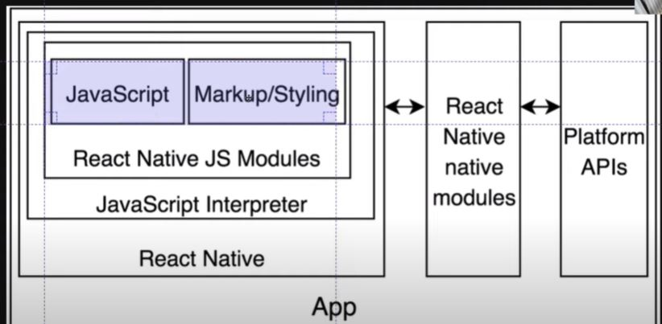

# React Native
React을 배우면서, React Native를 이용하면 모바일까지 만들 수 있다고해서 무척이나 기대했던 React Native!

## 0.1 React Native란? 
리액트를 사용할 줄 안다면,(state,prop,component 등)
ios와 안드로이드 앱개발을 할 수 있게해준다.

## 0.2 시작하기전에
당연히 react.js에 대해 알고있어야한다.

(state,props,useState,useEffect ..등)

## 0.3 SetUp
솔직히 말하자면 환경이 안좋다..

[앱을 만들기 위해 필요한 인프라]



웹으로 앱을 만드는 것이라, 앱을 만드는데 필요한 모든것을
다운받아야한다.

1. 설치할 것이 너무많다.

2. 설치하면서 에러가 많이 발생한다.

=> 그래서 java나 안드로이드 스튜디오를 다운받지 않고,

핸드폰에서 앱을 바로 테스트 할 수 있는 툴이 있다.

이 툴은 저 보라색부분만 빼고, 다 갖추고있다.

그래서 보라색부분(코드)만 작성할 것이고, 

나머지 부분은 앱스토어에 있기에 그 앱(Expo)을 다운받아 우리가 작성한 코드를 전송시킬것.

※ 테스트 목적으로만 사용할 것! 실제 배포용이 아니다.

[ 다운받기 ]
```node
//윈도우용
npm install --global expo-cli
```
터미널에서 expo-cli를 다운받았다면,

폰에서도 Expo를 설치해준다.(계정필요)

## 0.4 Creating The App
모든 설치가 끝났다면, expo init 원하는 앱이름을 적어준다.

```node
expo init weather 
```
그러면 옵션을 고르는 문구가 나오는데 첫번째 blank를 고르고 엔터를 친다.

## 0.5 사이트가 잘열리는지 확인

설치가 완료되었다면 폰(EXPO)으로 보이는지
확인해보자.

설치된 폴더의 package.json을 살펴보면,

5개의 scripts(command)가 있다.

```js
//weather/package.json
  "scripts": {
    "start": "expo start",
    "android": "expo start --android",
    "ios": "expo start --ios",
    "web": "expo start --web",
    "eject": "expo eject"
  },
```
여기서 eject는 시뮬레이터인데, java나 xcode가 없어서 실행불가능.

우리는 npm start만 사용한다.

```node
npm start
```

조금 기다리면, 자동으로 창이열리거나 주소가 나타난다.

http://localhost:19002

사이트가 잘보인다면, 이제 로그인을 해야한다.

## 0.6 컴퓨터/폰 로그인
사이트가 잘 나오는걸 확인했으니 ctrl+c로 닫고,

컴퓨터에서 먼저 로그인을 해준다.

```node
expo login
```

아이디와 비번을 치고, 다시실행 npm run start

사이트가 잘보이면, 이제 폰의 어플에 들어가보자.

그럼 작업한 프로젝트가 보인다.

프로젝트를 클릭시 로딩시간이 좀 걸리고,

App.js의 text부분이 보일것이다.

```js
//App.js
export default function App() {
  return (
    <View style={styles.container}>
      <Text>Open up App.js to start working on your app!</Text>
      <StatusBar style="auto" />
    </View>
  );
}
```

text부분을 수정해보자.
```js
   <Text>Hello! I made a ReactNative App!</Text>
```

이렇게 수정하고, 저장을 누르자마자 자동으로 새고침되어

작성한 글이 보인다.
